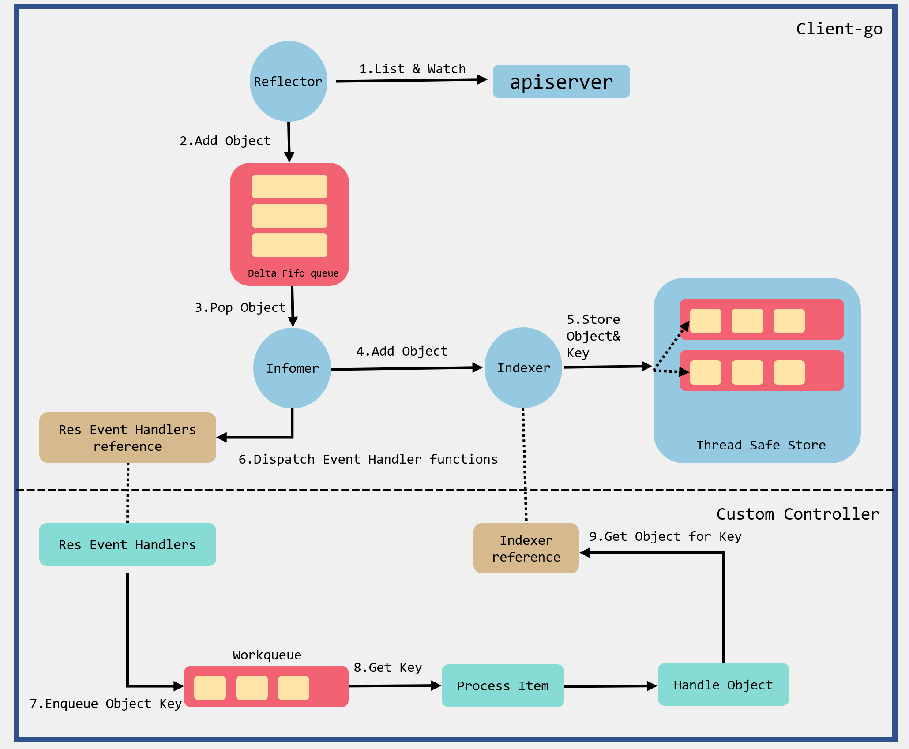
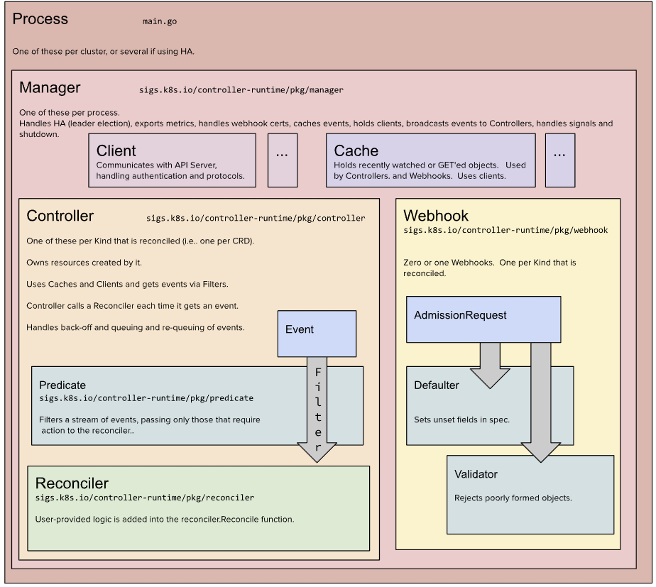

# K8S operator

https://github.com/baidingtech/operator-lesson-demo

## client-go

1. Reflector 通过 List & watch （rest api）获取集群资源信息。添加到DeltaQueue（记录资源变化）。
2. Indexer：用来存储资源对象并自带索引功能（查询不同namespece资源等功能）的本地存储，Informer从DeltaFIFO中将消费出来的资源对象存储至Indexer。
3. Informer调用回调函数将事件传入workqueue。
4. 事件处理函数消费workqueue中的事件（从Indexer获取资源信息）。

## kubebuilder

https://book.kubebuilder.io/

